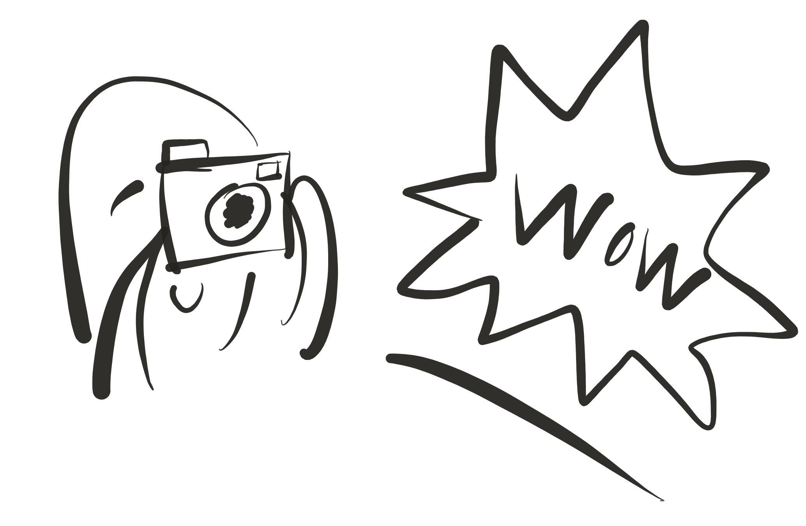
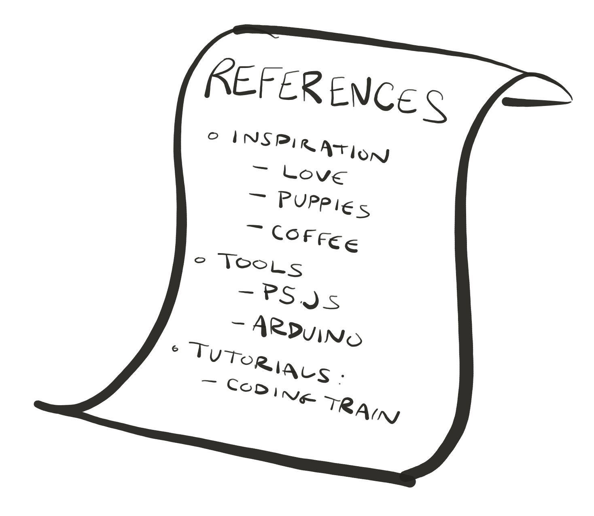

# ICMadness

As final project season approaches, you may feel the weight of coming up with a "big" "important" idea. This workshop is about doing the opposite: create a project based on [random instructions from a bot](https://itpnyu.github.io/ICMadness-2018/spin). What can you do in 2 hours as a collaboration of three random ICM students with three random things (action, technology, topic) put together?

- [ICMadness](#icmadness)
    - [Details](#details)
    - [Instructions](#instructions)
    - [Inspiration](#inspiration)
    - [Collaboration Tips](#collaboration-tips)
    - [Documentation](#documentation)
        - [Handy Tips](#handy-tips)
        - [Submit your post](#submit-your-post)

## Details
* ITP Lounge
* Friday, Nov 2nd
* 11am - 2pm
* Bring your laptop and anything else you might want to use to create.

## Instructions
1. Arrive at the ITP Lounge at least 5 minutes before 11am on Friday, Oct Nov 2nd.
2. Listen to a short schpiel.
3. [Find your group of three.](https://itpnyu.github.io/ICMadness-2018/groups/)
4. [Generate your project instructions: spin the wheel!](https://itpnyu.github.io/ICMadness-2018/spin/)
5. Start making stuff
7. Post a description and GIF / video to the [ICMadness 2018 blog](https://itp.nyu.edu/workshops/icm2018) -- [instructions below](#documentation)
7. Take a break to eat some delicious dumplings and gather back in the lounge at 1:30pm!

## Inspiration
* [Art Assignment Bot](https://twitter.com/artassignbot)
* [Generonimos by Kate Compton](http://www.galaxykate.com/generominos)

## Collaboration Tips
(adapted from ideas from Marina!)
* A successful collaboration requires a combination of autonomy, honesty, and accountability.
* Start discussing the skills you have and the things you are excited about.
* In a learning environment, you should do both things you like, things you want to learn.
* Things no one likes to do should be shared! 

## Documentation
Towards the end of ICMadness, we will spend a few minutes documenting your work by creating a post on the ICMadness 2018 Blog. This will include adding a gif of what you have made. To make the gif, you can use [giphy](https://giphy.com/create/gifmaker). 

### Handy Tips

Here's a few handy tips for documenting your work:

| Capture process sketches, images, etc |  Keep track of links | Organize and share |
|  :---:  |  :---:  |  :---:  |
|  |  |  | 

1. Take pictures and videos of your project development process. Pen-and-paper sketches, proofs of concept, and glitch are great materials that help to tell your story! 
2. Keep track of references and links to things that inspire you or help you overcome technical or conceptual challenges. References to the libraries or tutorials you used may be helpful for you or others who love your project. You can copy and paste those links or quotes to a text or markdown file as you work. If you're working on a team, a shared document where you can all simultaneously add links might be a great way to collaboratively share your references. A shared [Google Doc](https://www.google.com/docs/about/) or [Etherpad](https://public.etherpad-mozilla.org/) could be possible platforms for this.
3. At the end of your process, take a quick second to organize your links and paste them under a **References** section at the end of your documentation. You'll find that having all these links you saved while working will be helpful when telling the story about how your project developed! 

An example of all this can be seen [here](https://gist.github.com/joeyklee/313256314f0284c45b01b5d54923e683).

### Submit your post

1. Visit the blog [link](https://itp.nyu.edu/workshops/icm2018) and login with your NetID and password. (your netID is the same as your email adress, eg - rrp349)
2. To create a new post, click on the giant plus button on the top right and fill the form that it shows.
3. Note: The form field where you put in a gif accepts images/gifs of size < 2MB. You can also add links to your code or video. **Make sure to hyperlink all links.**
4. Once you're done with the form, hit submit and eat some dumplings!
